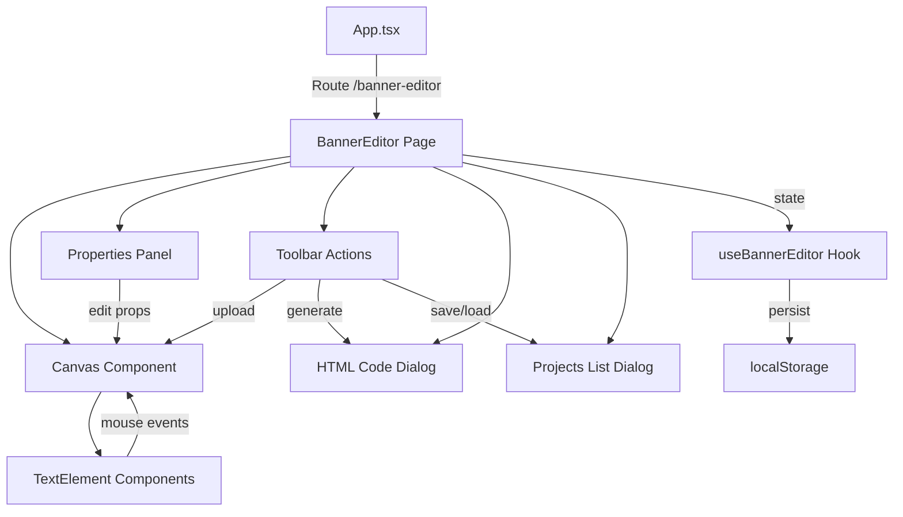

# Design — Editor de Layout de Banner

## Visão Geral

O Editor de Layout de Banner é uma nova página no DevPortal que permite criar layouts visuais de banners combinando uma imagem de fundo com elementos de texto posicionáveis. O editor segue a arquitetura existente do DevPortal: uma página em `src/pages/`, um hook customizado em `src/store/useStore.ts`, tipos em `src/types/index.ts`, e componentes auxiliares em `src/components/`.

O fluxo principal é:
1. O usuário faz upload de uma imagem de fundo
2. Adiciona elementos de texto e os posiciona via drag-and-drop nativo (mouse events)
3. Edita propriedades visuais (conteúdo, tamanho, cor, peso) no painel lateral
4. Visualiza o resultado em tempo real no canvas
5. Gera e copia o código HTML com Tailwind CSS
6. Salva/carrega projetos no localStorage

O drag-and-drop utiliza eventos nativos do mouse (`onMouseDown`, `onMouseMove`, `onMouseUp`) — sem bibliotecas externas. As posições dos elementos são armazenadas como porcentagens relativas ao canvas para comportamento responsivo.

## Arquitetura



O layout da página segue um padrão de duas colunas:
- Coluna principal (esquerda): Canvas com a imagem de fundo e elementos de texto
- Coluna lateral (direita): Painel de propriedades do elemento selecionado

A toolbar no topo da página contém os botões de ação: upload de imagem, adicionar texto, ver código HTML, salvar projeto e carregar projetos.

## Componentes e Interfaces

### Estrutura de Componentes

```
src/pages/BannerEditor.tsx          — Página principal (default export)
src/components/BannerEditor/
  ├── BannerCanvas.tsx              — Canvas de visualização com drag-and-drop
  ├── TextElementOverlay.tsx        — Elemento de texto individual no canvas
  ├── PropertiesPanel.tsx           — Painel de edição de propriedades
  ├── HtmlCodeDialog.tsx            — Dialog modal para exibir código HTML
  ├── ProjectsListDialog.tsx        — Dialog para listar/carregar/excluir projetos
  └── generateHtml.ts              — Função pura de geração de código HTML/Tailwind
```

### BannerEditor (Página)

Componente de página que orquestra o estado e renderiza o layout de duas colunas. Usa o hook `useBannerEditor` para persistência de projetos e mantém estado local para o projeto em edição (imagem, elementos de texto, elemento selecionado, dialogs abertos).

### BannerCanvas

Renderiza a área de visualização com a imagem de fundo e os `TextElementOverlay`. Quando nenhuma imagem está carregada, exibe um placeholder. Gerencia o container `ref` para calcular posições relativas durante o drag.

### TextElementOverlay

Componente individual de texto posicionável. Implementa drag-and-drop via `onMouseDown` no elemento, `onMouseMove` e `onMouseUp` no `document` (para capturar movimentos fora do elemento). Posição definida via `position: absolute` com `left`/`top` em porcentagem.

### PropertiesPanel

Formulário MUI com campos para editar: conteúdo (TextField), tamanho da fonte (Slider ou TextField numérico), cor (input type="color" ou TextField), peso da fonte (Select: normal/bold). Exibe apenas quando um elemento está selecionado.

### HtmlCodeDialog

Dialog MUI que exibe o código HTML gerado em um `<pre><code>` com formatação legível. Inclui botão "Copiar Código" que usa `navigator.clipboard.writeText()`.

### ProjectsListDialog

Dialog MUI com lista dos projetos salvos. Cada item mostra o nome do projeto e botões para carregar ou excluir.

### generateHtml (função pura)

Recebe um `BannerProject` e retorna uma string HTML com classes Tailwind CSS. Mapeia:
- Container: `relative` com dimensões
- Imagem de fundo: `` com `src` do Data URL, classes `w-full h-auto`
- Elementos de texto: `<span>` ou `<p>` com `absolute`, posição via `top`/`left` em porcentagem, e classes Tailwind para `text-[size]`, `font-bold`/`font-normal`, `text-[color]`


## Modelos de Dados

### Tipos TypeScript (em `src/types/index.ts`)

```typescript
export interface BannerTextElement {
  id: string;
  content: string;
  x: number;       // posição X em % (0-100)
  y: number;       // posição Y em % (0-100)
  fontSize: number; // em px
  color: string;    // hex string, ex: "#FFFFFF"
  fontWeight: 'normal' | 'bold';
}

export interface BannerProject {
  id: string;
  name: string;
  backgroundImage: string;  // Data URL (base64)
  textElements: BannerTextElement[];
  createdAt: string;        // ISO 8601
  updatedAt: string;        // ISO 8601
}
```

### Estado Local da Página (BannerEditor)

```typescript
// Estado gerenciado localmente no componente da página
interface BannerEditorLocalState {
  currentProject: {
    backgroundImage: string | null;
    textElements: BannerTextElement[];
  };
  selectedElementId: string | null;
  htmlDialogOpen: boolean;
  projectsDialogOpen: boolean;
}
```

### Hook `useBannerEditor`

```typescript
// Exportado de src/store/useStore.ts
export function useBannerEditor(): {
  projects: BannerProject[];
  saveProject: (project: Omit<BannerProject, 'id' | 'createdAt' | 'updatedAt'>) => BannerProject;
  updateProject: (project: BannerProject) => void;
  loadProject: (id: string) => BannerProject | undefined;
  deleteProject: (id: string) => void;
}
```

O hook segue o padrão `useLembrete`: usa `useState` inicializado com `loadFromStorage`, e cada mutação chama `saveToStorage` para persistir no localStorage sob a chave `devportal_banner_projects`.

### Chave localStorage

| Chave | Conteúdo |
|---|---|
| `devportal_banner_projects` | `BannerProject[]` serializado como JSON |

### Validação de Imagem

Formatos aceitos: `image/png`, `image/jpeg`, `image/jpg`, `image/webp`. A validação é feita pelo atributo `accept` do input file e por verificação programática do `file.type` antes da conversão para Data URL via `FileReader.readAsDataURL()`.

### Geração de HTML — Mapeamento de Estilos

| Propriedade MUI/Canvas | Classe Tailwind Gerada |
|---|---|
| Container relativo | `relative inline-block` |
| Imagem de fundo | `` |
| Posição X/Y (%) | `absolute` + `style="top: Y%; left: X%"` |
| fontSize (px) | `style="font-size: {n}px"` |
| color (hex) | `style="color: {hex}"` |
| fontWeight: bold | `font-bold` |
| fontWeight: normal | `font-normal` |

O posicionamento usa inline styles para `top`/`left`/`font-size`/`color` pois Tailwind não suporta valores arbitrários dinâmicos de forma limpa em HTML estático. As classes Tailwind são usadas para propriedades que mapeiam diretamente (font-weight, position, display).


## Propriedades de Corretude

*Uma propriedade é uma característica ou comportamento que deve ser verdadeiro em todas as execuções válidas de um sistema — essencialmente, uma declaração formal sobre o que o sistema deve fazer. Propriedades servem como ponte entre especificações legíveis por humanos e garantias de corretude verificáveis por máquina.*

### Propriedade 1: Validação de tipo de arquivo de imagem

*Para qualquer* arquivo selecionado pelo usuário, se o tipo MIME do arquivo estiver em `{image/png, image/jpeg, image/webp}` então o arquivo deve ser aceito e convertido para Data URL; caso contrário, o arquivo deve ser rejeitado e uma mensagem de erro deve ser exibida.

**Valida: Requisitos 2.2, 2.3**

### Propriedade 2: Unicidade de IDs dos elementos de texto

*Para qualquer* sequência de N operações de "Adicionar Texto" em um canvas, todos os N elementos de texto resultantes devem possuir IDs distintos entre si, e a lista deve conter exatamente N elementos.

**Valida: Requisitos 3.3, 3.7**

### Propriedade 3: Remoção de elemento de texto

*Para qualquer* lista de elementos de texto e qualquer elemento selecionado dessa lista, após a remoção, a lista resultante deve ter exatamente um elemento a menos e não deve conter o elemento removido (verificado pelo ID).

**Valida: Requisitos 3.6**

### Propriedade 4: Cálculo e limitação de posição

*Para qualquer* posição de mouse (mouseX, mouseY) e quaisquer dimensões de canvas (width, height), as coordenadas calculadas em porcentagem devem estar no intervalo [0, 100], e para posições dentro do canvas, o cálculo deve ser `(mouseOffset / canvasDimension) * 100`.

**Valida: Requisitos 4.3, 4.4**

### Propriedade 5: Corretude da geração de HTML

*Para qualquer* `BannerProject` válido com uma imagem de fundo e N elementos de texto, o HTML gerado deve: (a) conter um container com classe `relative`, (b) conter uma tag `` com o Data URL da imagem no atributo `src`, (c) conter exatamente N elementos de texto com classe `absolute`, e (d) cada elemento de texto deve incluir as propriedades de estilo correspondentes (tamanho de fonte, cor, peso).

**Valida: Requisitos 7.2, 7.4, 7.5, 7.6**

### Propriedade 6: Round-trip de salvar/carregar projeto

*Para qualquer* `BannerProject` válido, serializar e salvar no localStorage e depois carregar deve produzir um objeto equivalente ao original — mesma imagem de fundo, mesmos elementos de texto com mesmas posições, conteúdos e estilos.

**Valida: Requisitos 9.2, 9.4, 9.8, 10.3**

### Propriedade 7: Exclusão de projeto

*Para qualquer* lista de projetos salvos e qualquer projeto dessa lista, após a exclusão, a lista resultante deve ter exatamente um projeto a menos, o projeto excluído não deve ser recuperável por ID, e os demais projetos devem permanecer inalterados.

**Valida: Requisitos 9.6**


## Tratamento de Erros

| Cenário | Comportamento |
|---|---|
| Upload de arquivo com tipo inválido | Exibir mensagem de erro via Snackbar informando formatos aceitos (PNG, JPG, JPEG, WebP). Não alterar o estado do canvas. |
| Falha ao copiar para clipboard | Capturar exceção de `navigator.clipboard.writeText()`, exibir Snackbar de erro informando a falha. |
| localStorage cheio (QuotaExceededError) | Capturar exceção ao salvar, exibir Snackbar informando que o armazenamento está cheio. Imagens base64 grandes podem causar isso. |
| Dados corrompidos no localStorage | `loadFromStorage` já retorna fallback (array vazio) em caso de erro de parse JSON. Projetos corrompidos são ignorados silenciosamente. |
| Projeto sem imagem de fundo ao gerar HTML | Desabilitar o botão "Ver Código HTML" quando não houver imagem de fundo carregada. |
| Tentativa de editar propriedades sem elemento selecionado | Painel de propriedades exibe mensagem "Selecione um elemento de texto" em estado desabilitado. |

## Estratégia de Testes

### Testes Unitários

Testes unitários focam em exemplos específicos, edge cases e condições de erro:

- **generateHtml**: Verificar saída HTML para um projeto com 0 elementos, 1 elemento, e múltiplos elementos com estilos variados.
- **Validação de imagem**: Verificar aceitação de PNG/JPG/WebP e rejeição de PDF/GIF/SVG.
- **Criação de elemento padrão**: Verificar que novo elemento tem conteúdo "Novo Texto" e posição (50, 50).
- **Edge cases**: Projeto sem elementos de texto, elemento com conteúdo vazio, posições nos limites (0% e 100%).

### Testes de Propriedade (Property-Based Testing)

Biblioteca: **fast-check** (para TypeScript/JavaScript).

Cada teste de propriedade deve executar no mínimo 100 iterações e referenciar a propriedade do design.

| Teste | Propriedade | Tag |
|---|---|---|
| Validação de tipo MIME | Propriedade 1 | `Feature: banner-layout-editor, Property 1: Image file type validation` |
| Unicidade de IDs | Propriedade 2 | `Feature: banner-layout-editor, Property 2: Text element ID uniqueness` |
| Remoção de elemento | Propriedade 3 | `Feature: banner-layout-editor, Property 3: Text element removal` |
| Cálculo de posição | Propriedade 4 | `Feature: banner-layout-editor, Property 4: Position calculation and clamping` |
| Geração de HTML | Propriedade 5 | `Feature: banner-layout-editor, Property 5: HTML generation correctness` |
| Round-trip save/load | Propriedade 6 | `Feature: banner-layout-editor, Property 6: Project save/load round-trip` |
| Exclusão de projeto | Propriedade 7 | `Feature: banner-layout-editor, Property 7: Project deletion` |

Cada propriedade de corretude deve ser implementada por um único teste de propriedade usando fast-check. Os geradores devem produzir:
- Strings arbitrárias para conteúdo de texto (incluindo strings vazias e com caracteres especiais)
- Números no intervalo válido para posições (0-100) e fora dele (para testar clamping)
- Tipos MIME aleatórios (válidos e inválidos)
- Listas de `BannerTextElement` com tamanhos variados
- `BannerProject` completos com todos os campos

Os testes unitários e de propriedade são complementares: testes unitários capturam bugs concretos em exemplos específicos, enquanto testes de propriedade verificam corretude geral através de randomização extensiva.
